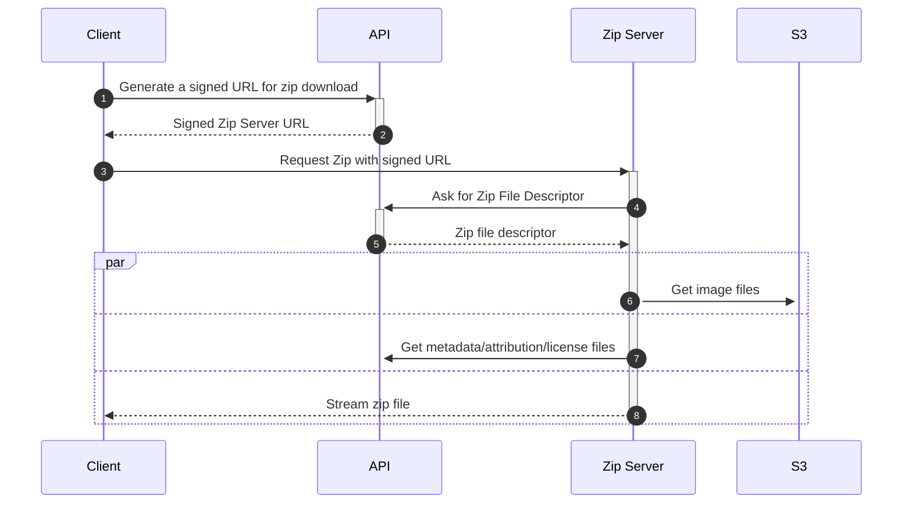

# Zip Download Flow

This diagram illustrates the flow for downloading images as a zip file.

## Security

### Step 1: Client → API (Generate signed URL)
- User's identity and search parameters are captured

### Step 2: API → Client (Return signed URL)
- URL contains a cryptographically signed token (Django `TimestampSigner`)
- Token expires after 1 day
- Token encodes: user ID, search query, collection filters

### Step 3: Client → Zip Server (Request zip)
- Client opaquely passes the signed token to the external zip server
- Token serves as proof of authorization

### Step 4: Zip Server → API (Request file descriptor)
- Zip server is hardcoded to retrieve the descriptor from the one true API server with the given zsid
- Token validation via `ZipDownloadTokenAuth`
- Verifies signature and checks 24-hour expiration

### Step 5: API → Zip Server (Return file descriptor)
- API returns file listing only for images the user is authorized to access
- Descriptor contains bare unsigned S3 URLs for images and API URLs for metadata files
- Query is executed with user's permissions applied

### Step 6: Zip Server → S3 (Fetch images)
- **Public images** (sponsored bucket):
  - Bucket has public read policy
- **Private images** (default bucket):
  - Bucket and all objects are private
  - Zip server has the an instance profile granting explicit read access

### Step 7: Zip Server → API (Fetch metadata/attribution/license files)
- Same token authentication as Step 4
- Files are generated on-the-fly
- Each request validates the token
